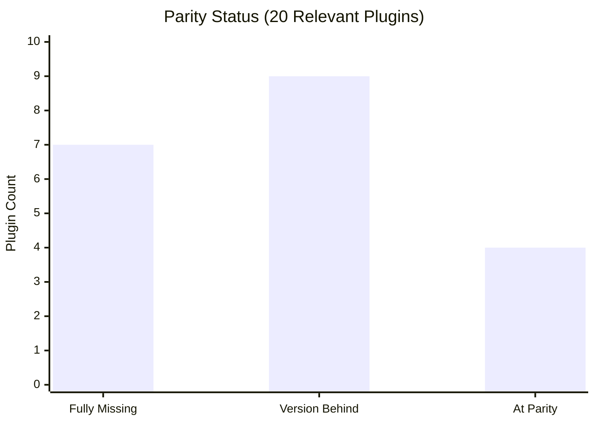

# Feature Parity Report: `antigravity-suite` vs `ClaudeWorkspace`

> **Generated**: 2026-10-02  
> **Baseline** (target): `ClaudeWorkspace` — 30 standalone repos (the "source of truth")  
> **Subject** (under audit): `antigravity-suite` — 13 monorepo packages

---

## Executive Summary

The `antigravity-suite` monorepo captures **13 of 20** relevant Haiggoh plugins from `ClaudeWorkspace`. Of those 13, **9 have significant version drift** (the standalone repo is ahead). Additionally, **7 standalone plugins have no monorepo equivalent at all**, and the hook/lifecycle architecture diverges substantially.

---

## 1. Entirely Missing Plugins (7)

These exist in `ClaudeWorkspace` but have **no equivalent package** in `antigravity-suite`:

| # | Plugin | CW Version | What It Does | Priority |
|---|--------|-----------|--------------|----------|
| 1 | **`check-code`** | v0.1.0 | `PostToolUse` hook running `ruff check` / `shellcheck` on edited lines, returning findings inline | 🔴 High — active governance |
| 2 | **`summon-skills`** | v0.1.1 | Dynamic skill discovery engine; `SessionStart` catalogs skills, `UserPromptSubmit` suggests 1–3 relevant matches | 🔴 High — UX improvement |
| 3 | **`lasting-plans`** | v0.3.0 | Protects plans/playbooks from auto-purge; git-versioned archives in `~/Claude-plans`; launchd watcher | 🟠 Medium — data preservation |
| 4 | **`claude-code-desktop-sync`** | v1.0.2 | 3-way MCP server config reconciliation between CLI (`~/.claude.json`) and Desktop app | 🟠 Medium — multi-client sync |
| 5 | **`codex-cost-tracker`** | v0.5.0 | Read-only token estimation for OpenAI Codex transcripts; Admin API sync | 🟡 Low — Codex-specific |
| 6 | **`claude-code-permission-probe`** | active | Security probe harness testing sandbox boundaries via mock API | 🟡 Low — dev/testing tool |
| 7 | **`mac-claude-migration`** | active | Backup/restore toolchain for migrating Claude Code state to a new Mac | 🟡 Low — one-time utility |

> [!IMPORTANT]
> **`check-code`** and **`summon-skills`** are the most impactful gaps — they provide active in-session governance and UX that the monorepo completely lacks.

---

## 2. Version Drift — Matched Packages Behind (9)

These packages exist in both repos, but the monorepo lags behind the standalone version:

### 2.1 Critical Drift (standalone ≥ 2× ahead)

| Package | Suite Version | CW Version | Delta | Key Missing Features |
|---------|:---:|:---:|:---:|---|
| **`transcript-distiller`** | v0.1.0 | v0.8.3 | ⚠️ **v0.1→v0.8** | Dual output (`.compact.jsonl.txt` + `.indexed_capsule.md`), v3 compaction engine, 8 test suites vs 0 |
| **`audit-loose-ends`** | v0.5.5 | v0.10.0 | ⚠️ **v0.5→v0.10** | Missing scripts: `verify-state.py`, `redact-secret.py`, `waypoint-reconcile.py`, `observation-log.py`, `memory-index-audit.py`; missing `harvest-lessons` skill; 7 vs 3 test files |
| **`local-delegate`** | v0.13.9 | v0.21.0 | ⚠️ **v0.13→v0.21** | Missing: remote inference lane (14+ free cloud providers), `lk`/`lowkey` subtask CLI, `git-local-review`, guard hooks (`guard-own-endpoint`, `guard-tool-owned-state`), stop-hook queue drain, transcript identity; 61 vs 30 test suites |
| **`cost-tracker`** | v0.4.0 | v0.9.1 | ⚠️ **v0.4→v0.9** | Missing: `statusline-render.sh`, `cost-ledger-capture.sh`, `budget-tally.py`, `markup` command; 13 vs 4 test files |

### 2.2 Moderate Drift

| Package | Suite Version | CW Version | Delta | Key Missing Features |
|---------|:---:|:---:|:---:|---|
| **`waypoints`** | v0.8.0 | v0.11.0 | v0.8→v0.11 | Missing CLI commands: `search`, `restore`, `rm`, `archive`, `toggle`, `reorder`, `prune`, `unpin`; additive plan protection rules |
| **`no-hidden-changes`** | v1.0.0 | v1.7.0 | v1.0→v1.7 | Missing: `sudo-in-terminal.sh`, `reconcile-check.sh` SessionStart hook, tests |
| **`run-to-completion`** | v0.5.0 | v0.6.0 | v0.5→v0.6 | Missing: SessionStart nudge hook |
| **`resume-interrupted`** | v0.4.0 | v0.4.1 | v0.4.0→v0.4.1 | Missing: interactive `interrupted` session browser CLI |
| **`brief-agents`** | v0.1.4 | v0.1.5 | v0.1.4→v0.1.5 | Missing: `PreToolUse` injection hook (`brief-pretool.py`), staleness check hook |

---

## 3. At or Near Parity (4)

| Package | Suite Version | CW Version | Status |
|---------|:---:|:---:|---|
| **`get-antigravity`** / `get-haiggoh` | v1.0.0 | v0.7.0 | ✅ Suite is **ahead** (rebranded & consolidated) |
| **`agy-measure-twice`** | v1.0.0 | v0.2.0 | ✅ Suite is **ahead** |
| **`agy-statusline`** | v1.1.0 | *(embedded in cost-tracker/local-agents)* | ✅ Suite extracted this as a standalone — **ahead** |
| **`agy-sync`** | v1.0.0 | *(no standalone equivalent)* | ✅ Suite-only package — **new** |

---

## 4. Hook / Lifecycle Architecture Gap

> [!WARNING]
> The `antigravity-suite` uses Antigravity's `PreInvocation` hook model, while `ClaudeWorkspace` uses Claude Code's richer `hooks.json` architecture with 6 distinct lifecycle events. Several governance features depend on hooks that have no equivalent in the suite.

### Hooks present in ClaudeWorkspace but absent from antigravity-suite:

| Hook Event | Plugin | Hook Script | Purpose |
|---|---|---|---|
| `SessionStart` | `local-agents` | `offload-nudge.py` | Nudges user toward local/free lanes |
| `SessionStart` | `local-agents` | `transcript-identity.py` | Tags transcript with lane metadata |
| `SessionStart` | `get-haiggoh` | `check-installed.py` | Warns about outdated/missing plugins |
| `SessionStart` | `summon-skills` | *(scan)* | Catalogs installed skills at startup |
| `SessionStart` | `no-hidden-changes` | `reconcile-check.sh` | Verifies state consistency |
| `SessionStart` | `audit-loose-ends` | `nudge.sh` | Reminds about unresolved items |
| `SessionStart` | `run-to-completion` | `nudge.sh` | Offers autonomous continuation |
| `UserPromptSubmit` | `summon-skills` | *(matcher)* | Suggests relevant skills per prompt |
| `UserPromptSubmit` | `local-agents` | `session-title-prefix.py` | Prefixes session with lane name |
| `PreToolUse` | `brief-agents` | `brief-pretool.py` | Injects rules into subagent calls |
| `PreToolUse` | `local-agents` | `guard-own-endpoint.py` | Blocks killing active proxy |
| `PreToolUse` | `local-agents` | `guard-tool-owned-state.py` | Prevents destructive config edits |
| `PostToolUse` | `check-code` | `check-code.py` | Lint feedback on edited lines |
| `Stop` | `local-agents` | `local-queue-stop-hook.py` | Drains queued prompts before exit |

---

## 5. Test Coverage Gap

| Area | Suite Tests | CW Tests | Gap |
|---|:---:|:---:|---|
| local-delegate / local-agents | 30 | 61 | **−31** |
| cost-tracker | 4 | 13 | **−9** |
| transcript-distiller | 0 | 8 | **−8** |
| audit-loose-ends | 3 | 7 | **−4** |
| waypoints | 328 | 5 files (comparable) | ≈ parity |
| check-code | ❌ | 1 | **−1** (missing entirely) |
| summon-skills | ❌ | 1 | **−1** (missing entirely) |
| lasting-plans | ❌ | 1 | **−1** (missing entirely) |
| **Total estimated gap** | | | **~55+ test files behind** |

---

## 6. Non-Applicable Exclusions

These ClaudeWorkspace items are **external forks, personal utilities, or reference docs** — not candidates for monorepo inclusion:

| Item | Reason for Exclusion |
|---|---|
| `TypeGPU` | External fork (`software-mansion/TypeGPU`) |
| `video-use` | External fork (`browser-use/video-use`) |
| `blender-mcp` | Third-party MCP addon |
| `surreal-waterfall` | Design runbook / reference assets |
| `JoyIA-Chat-documentation` | API reference docs |
| `joyia-imports` | Architecture specs |
| `mac-iphone-backup-cloudsync` | Personal Swift utility |
| `maccy-backup-script` | Personal launchd config |
| `human-shell` | Standalone ZSH utility (Homebrew-distributed) |
| `claude-turn-speak` | Standalone Node.js TTS utility |

---

## 7. Recommended Action Plan

### Phase 1 — Close Critical Gaps (High Impact)
1. **Port `check-code`** → `agy-check-code` — PostToolUse lint governance
2. **Port `summon-skills`** → `agy-summon-skills` — dynamic skill discovery
3. **Sync `agy-transcript-distiller`** from v0.1.0 → v0.8.3 (biggest version gap)
4. **Sync `agy-audit-loose-ends`** from v0.5.5 → v0.10.0 (5 missing scripts + skill)

### Phase 2 — Sync Version Drift (Medium Impact)
5. **Sync `agy-local-delegate`** from v0.13.9 → v0.21.0 (remote lane, guards, lowkey CLI)
6. **Sync `agy-cost-tracker`** from v0.4.0 → v0.9.1 (ledger capture, budget tally)
7. **Sync `agy-waypoints`** from v0.8.0 → v0.11.0 (8 missing CLI commands)
8. **Sync `agy-no-hidden-changes`** from v1.0.0 → v1.7.0 (sudo-in-terminal, reconcile hook)

### Phase 3 — Fill Remaining Gaps (Lower Priority)
9. **Port `lasting-plans`** → `agy-lasting-plans` — plan preservation
10. **Port `claude-code-desktop-sync`** → evaluate overlap with `agy-sync`
11. **Sync remaining minor version drift** (`run-to-completion`, `resume-interrupted`, `brief-agents`)

### Phase 4 — Infrastructure
12. **Backfill test coverage** — especially transcript-distiller (0→8), local-delegate (+31), cost-tracker (+9)
13. **Evaluate hook architecture mapping** — translate Claude Code `hooks.json` patterns to Antigravity equivalents
